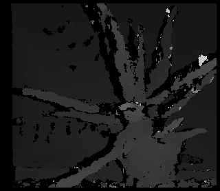
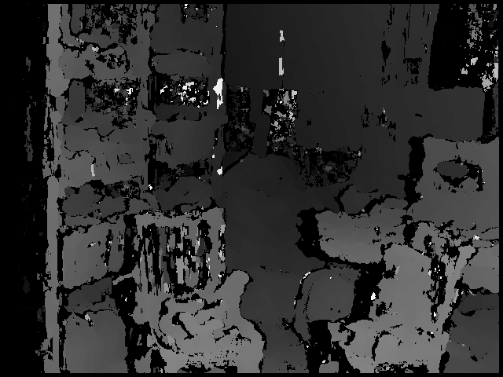

# StereoBM_JS

#### 描述
一个经典的双目视觉BM算法（块匹配算法），JavaScript版本。

#### 说明
这是一个经典的双目视觉BM算法
这个算法效果普通，但实现很简单便于阅读和理解

#### [Github镜像](https://github.com/redpower1998/StereoBM_js) ####

[]
[]

#### 系统需求 ####

代码在Windows10， Ubuntu 18.04下通过测试。
以下浏览器被测试通过：
- Edge, Chrome, Firefox

其他支持Html5的现代浏览器理论上也支持

#### 运行 ####

```WebBrowser
>>打开任何支持Html5的浏览器，例如Edge，Chrome，Firefox。 在浏览器中打开index.html文件。
>>选择左图和右图，点击计算即可。
>>注意：如果图较大，计算时间会很长，这时候浏览器可能会失去响应。 请耐心等待。
```

#### 已知问题 ####

无

#### 许可协议 ####
BSD 2-Clause License. See LICENSE.txt for further details.


